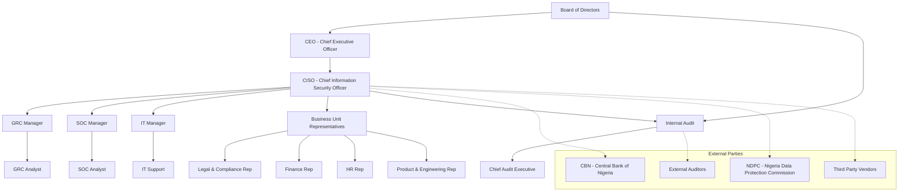

# Novalink Technologies Ltd — Security Governance Org Chart

## Document Information
- Document Owner: Omotayo Akinola
- Role: GRC Consultant
- Organization: GRC Consulting Firm
- Date: April 2026
- Version: 1.0
- Classification: Confidential

---

## Purpose
This document defines the security governance structure of Novalink
Technologies Ltd. It establishes clear lines of authority, accountability
and responsibility for information security across the organization.

---

## Security Governance Structure

---

## Governance Layers Explained

### Layer 1 — Board of Directors
- Ultimate accountability for information security at Novalink
- Approves overall security strategy and risk appetite
- Ensures adequate resources are allocated to the security program
- Reviews and approves major security policies

### Layer 2 — Security Leadership
- CEO sets the tone for security culture across the organization
- CISO owns and drives the entire information security program
- Translates board directives into actionable security strategies
- Reports security posture and incidents to the Board

### Layer 3 — Security Managers
- GRC Manager oversees governance, risk and compliance activities
- SOC Manager manages day to day threat detection and incident response
- IT Manager oversees infrastructure, networks and system administration
- Each manager is accountable for security within their domain
- All report directly to the CISO

### Layer 4 — Operational Security
- GRC Analyst conducts risk assessments and compliance monitoring
- SOC Analyst monitors security alerts and investigates incidents
- IT Support maintains systems and implements technical controls
- These roles form the frontline of Novalinks security operations

### Layer 5 — Business Unit Representatives
- Represent their departments in all security governance matters
- Ensure security policies are followed in their business units
- Act as the bridge between security team and their department
- Participate in security awareness and training programs

### Layer 6 — Oversight and Assurance
- Internal Audit independently verifies security control effectiveness
- Chief Audit Executive reports directly to the Board of Directors
- Provides assurance that security risks are being managed properly
- Ensures Novalink remains compliant with applicable regulations

### Layer 7 — External Parties
- CBN regulates and supervises Novalinks financial operations
- NDPC enforces data protection compliance under the NDPR
- External Auditors provide independent third party assurance
- Third Party Vendors must comply with Novalinks security requirements

---

## Governance Principles
1. Security governance follows a top down approach where accountability
   starts at the Board level
2. Every layer has clearly defined responsibilities to avoid gaps
   and overlaps in security coverage
3. Business units are active participants in security governance
   not passive recipients of security policies
4. Independent oversight through Internal Audit ensures objectivity
   and continuous improvement
5. External regulatory compliance is embedded into the governance
   structure at every level

---
Document Owner: Omotayo Akinola
Role: GRC Consultant
Organization: GRC Consulting Firm
Date: April 2026
Version: 1.0
Classification: Confidential
